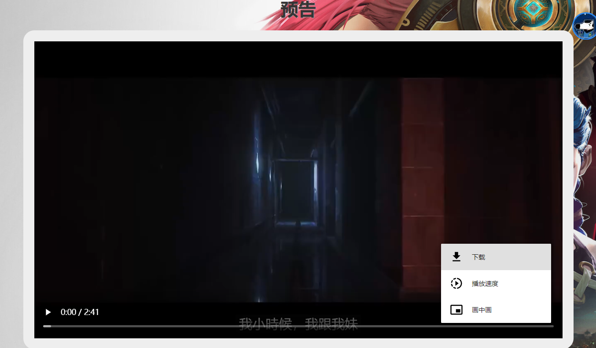
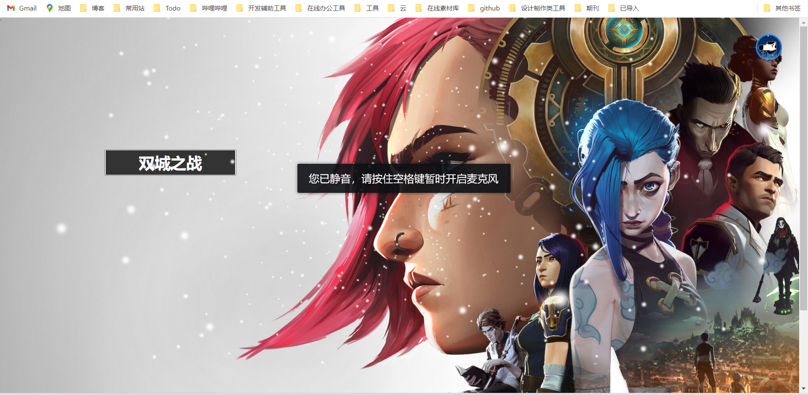
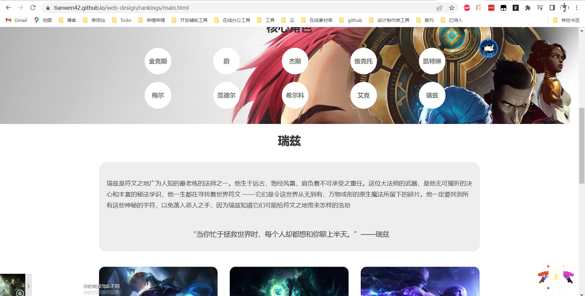

# 双城之战

可以点击查看效果

[https://tianwen42.github.io/web-design/](https://tianwen42.github.io/web-curriculum-design/)

## kico响应式前端框架。

## 阿里矢量图标

## 鼠标以及点击特效

## Badge

design

> https://img.shields.io/badge/Dsigned%20BY-Yanglin-green

> https://badg.vercel.app/badge/hosted/aliyun/orange?color=black&icon=aliyun

> https://badg.vercel.app/badge/cdn/Jsdelivr/blue?color=black&icon=npm

> https://badg.vercel.app/badge/icon/wechat/grey?icon=wechat&label

> https://badg.vercel.app/badge/icon/QQ/green?icon=qq&label

> https://badg.vercel.app/badge/icon/alipay/red?icon=alipay&label

## 图像轮播

## 音乐播放

Aplayer音乐播放器

## b站视频

## 雪花特效

## 旋转特效

## css响应式布局

## ajax异步技术

实现局部刷新，减小负载（**在本地调试的时候浏览器会禁止跨域请求，需要自行设置**）

