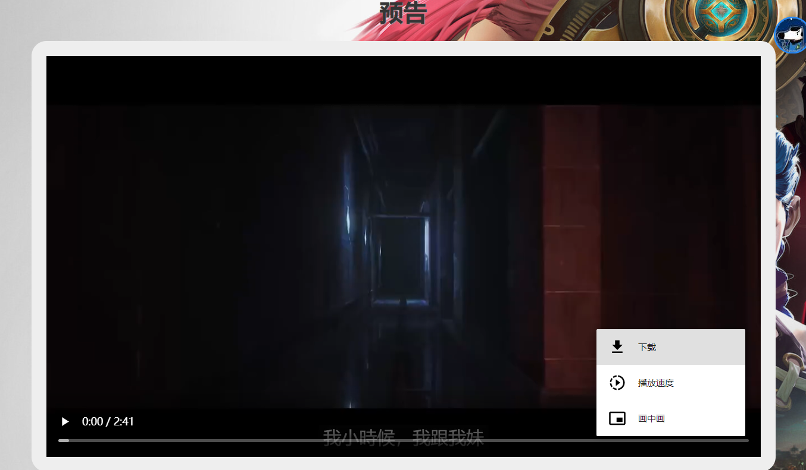
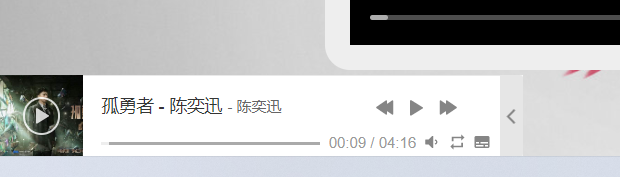
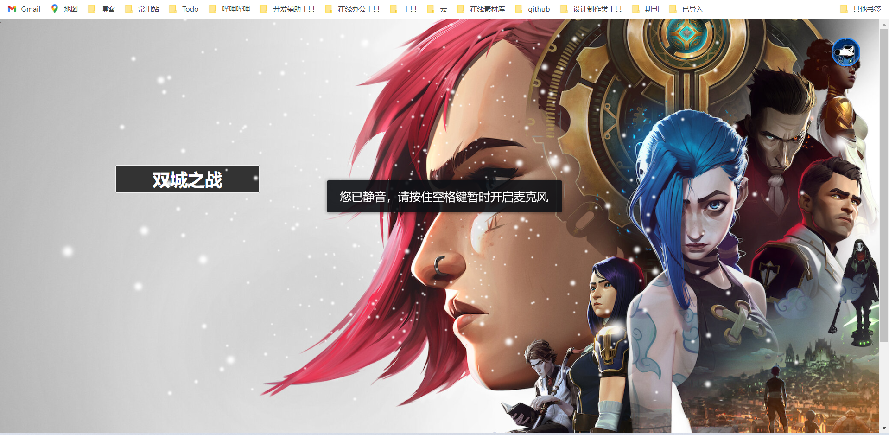
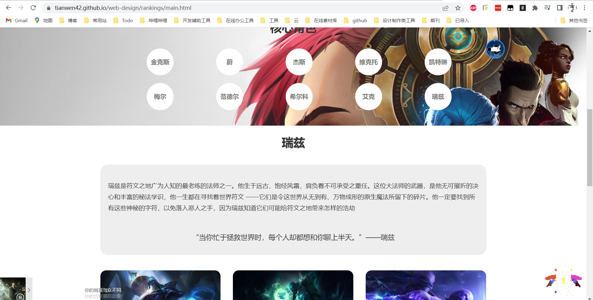

# 🌐 双城之战 (Arcane) - 网页设计

这是一个基于《英雄联盟：双城之战》主题设计的响应式网页项目，集成了多种前端特效与交互功能。

---

## 🚀 项目亮点

### 🎨 视觉与交互
- **响应式布局**: 基于 [kico](https://github.com/Kico-Style/Kico-Style) 前端框架，适配各种屏幕尺寸。
- **图标展示**: 集成阿里巴巴矢量图标库，提供清晰美观的 UI 元素。
- **动态特效**: 
  - ❄️ **雪花飘落**: 动态背景特效，增加页面氛围感。
  - ✨ **交互反馈**: 鼠标移动与点击特效。
  - 🔄 **3D 旋转**: CSS 实现的旋转特效。

### 🎵 媒体集成
- **音乐播放器**: 使用 [APlayer](https://aplayer.js.org/) 实现美观的底部音乐播放功能。
- **视频嵌入**: 集成 B 站视频，增强内容表现力。
- **图像轮播**: 流畅的图片展示体验。

### 🛠️ 技术特性
- **AJAX 异步请求**: 实现局部内容刷新，提升用户体验（*注：本地调试需注意跨域设置*）。
- **Badge 徽章**: 使用自定义徽章展示项目信息。

---

## 📸 项目截图

| 首页预览 | 视频详情 |
| :---: | :---: |
|  |  |

| 音乐播放 | 雪花特效 |
| :---: | :---: |
|  |  |

| 旋转特效 | AJAX 加载 |
| :---: | :---: |
|  |  |

---

## 🛠️ 技术栈

- **Frontend**: HTML5, CSS3, JavaScript
- **Libraries**: jQuery, Kico-Style, APlayer
- **Assets**: Aliyun OSS, Jsdelivr CDN

---

## 👤 关于作者

  
  
  
  
  

---

## 📄 开源协议

本项目采用 [MIT License](LICENSE) 开源协议。
